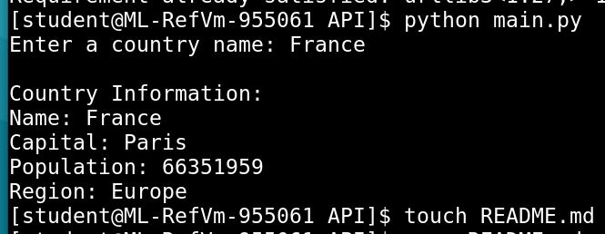

##Country Information API Project

## API Used
REST Countries API
https://restcountries.com/

## Access Method
I used a GET request in Python with the requests library.

## How It Works
The program asks the user to enter a country name.
It sends a GET request to the REST Countries API.
The API returns JSON data.
I extract the country name, capital, population, and region from the JSON and print them.

## How to Run
python main.py

## Screenshot

